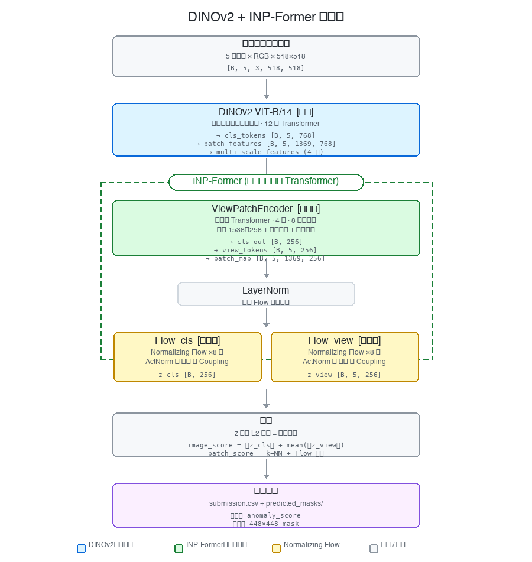
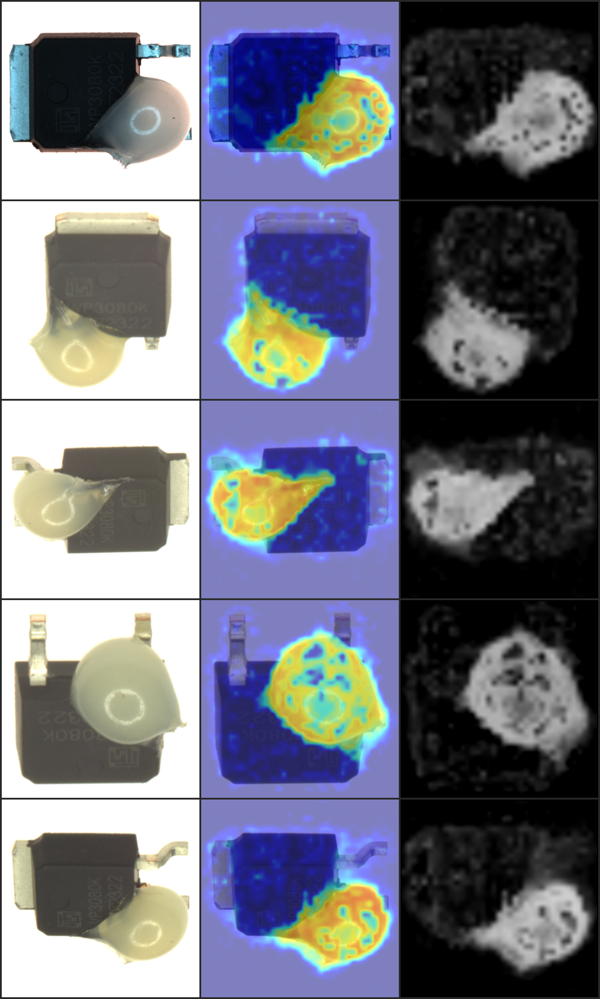
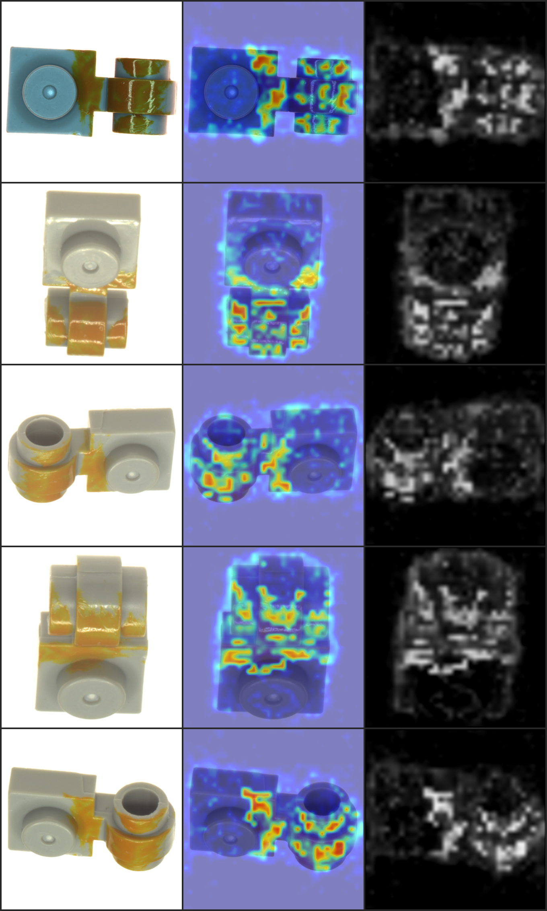
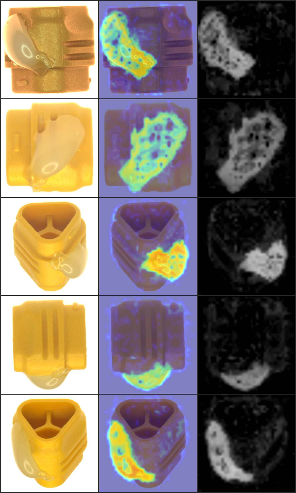
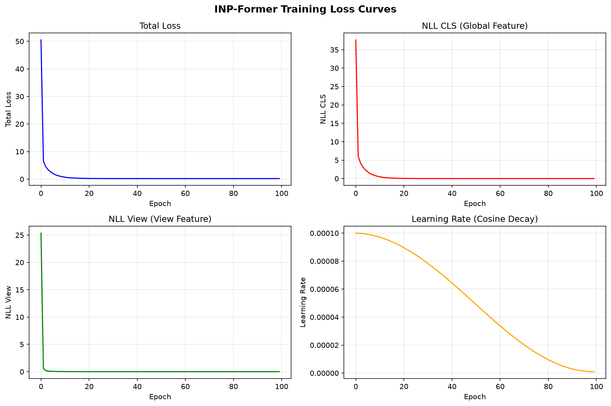

# DINOv2 + INP-Former 无监督异常检测

基于 **DINOv2** 特征提取器和 **INP-Former**（可逆神经过程 Transformer）的无监督异常检测框架，用于 Real-IAD Variety 多视角工业缺陷数据集。

## 技术架构

**核心思路**：
1. **DINOv2**（冻结）提取每个视角的 patch-level 语义特征
2. **ViewPatchEncoder** 用 Transformer 同时建模视角内空间关系 + 视角间对应关系
3. **Normalizing Flow** 将编码后的正常特征映射到标准高斯分布
4. 推理时通过 **负对数似然 (NLL)** 判断异常：偏离正常分布越远，得分越高

## 异常检测结果展示

以下展示测试集部分异常样本的检测结果。每张图包含 5 个视角，每行 3 列：**原图 | 异常热力图 | 黑白 mask**。

热力图使用 jet colormap 叠加到原图上（蓝色=正常，红色=异常），mask 为灰度图（与提交格式一致）。

### Demo 1

### Demo 2

### Demo 3

## 训练 Loss 曲线

训练过程在 RTX 5070 Ti (16GB) 上完成，全量 50 个类别，100 epochs，batch_size=8，518×518 输入尺寸。

**训练配置**：
- 优化器：AdamW（lr=1e-4，weight_decay=1e-5）
- 调度器：Cosine Annealing（5 epoch warmup）
- 混合精度：AMP FP16

**收敛情况**（100 epochs）：

| 指标 | 初始值 (Epoch 0) | 最终值 (Epoch 99) | 收敛倍数 |
|------|:---:|:---:|:---:|
| Total Loss | 50.48 | 0.20 | 252× |
| NLL CLS (z 空间 L2 距离) | 37.64 | 0.0014 | 26886× |
| NLL View (视角 z 距离) | 25.36 | 0.0001 | 253600× |

**训练信号说明**：
- **NLL CLS**：全局 CLS token 经 Flow 映射后的 z 空间到原点距离（`0.5 × ||z_cls||²`），正常样本趋近于 0
- **NLL View**：每个视角汇总 token 的 z 空间距离（`0.5 × ||z_view||²`），正常样本趋近于 0
- **Learning Rate**：Cosine decay 从 1e-4 衰减到 ~1.6e-6

> **注意**：训练损失使用 z 空间距离而非经典 NLL（`0.5*||z||² - log_det`），去除了 log_det 项以防止 Flow 通过膨胀雅可比行列式作弊导致 NLL 变负。
