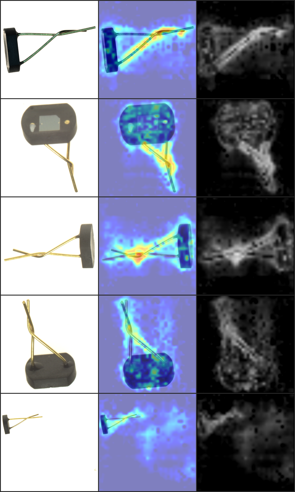
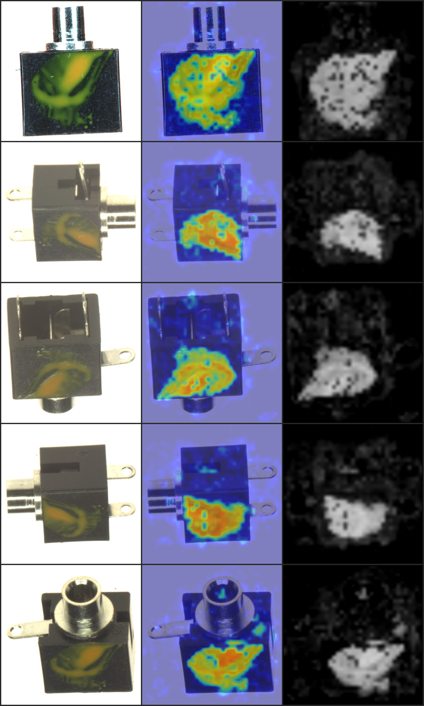
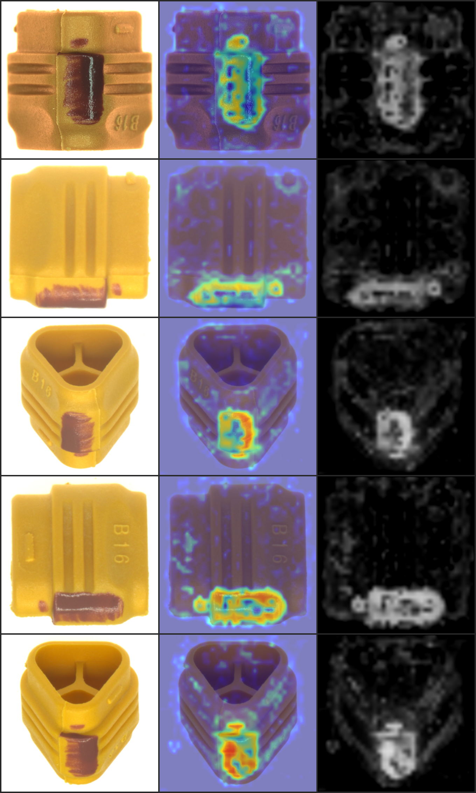

# DINOv2 + INP-Former 无监督异常检测

基于 **DINOv2** 特征提取器和 **INP-Former**（可逆神经过程 Transformer）的无监督异常检测框架，用于 Real-IAD Variety 多视角工业缺陷数据集。

## 技术架构

```
输入图像 [B, V=5, C, H, W]
    ↓
DINOv2 ViT-B/14 (冻结) → 多尺度 patch 特征 [B, V, N, 768]
    ↓
ViewPatchEncoder (Transformer) → 编码特征 [B, 1+V*N, 256]
    ↓
Normalizing Flow → 学习正常分布 → NLL 异常得分
```

**核心思路**：
1. **DINOv2**（冻结）提取每个视角的 patch-level 语义特征
2. **ViewPatchEncoder** 用 Transformer 同时建模视角内空间关系 + 视角间对应关系
3. **Normalizing Flow** 将编码后的正常特征映射到标准高斯分布
4. 推理时通过 **负对数似然 (NLL)** 判断异常：偏离正常分布越远，得分越高

## 环境要求

- Python ≥ 3.10
- [uv](https://docs.astral.sh/uv/) 包管理器（推荐）

```bash
# 安装 uv
curl -LsSf https://astral.sh/uv/install.sh | sh
```

## 快速开始

### 1. 安装依赖

```bash
cd eraft-solution

# macOS / CPU 环境（自动从 PyPI 拉取 CPU/MPS 版 torch）
uv sync

# GPU / Linux 环境 —— RTX 30/40 系列（CUDA 12.4）
uv sync --index pytorch-cu124

# GPU / Linux 环境 —— RTX 50 系列 Blackwell（CUDA 12.8）
uv sync --index pytorch-cu128

# 可选：安装开发依赖（ipython, matplotlib, tensorboard）
uv sync --extra dev
```

> **RTX 50 系列用户**：必须使用 CUDA 12.8+ 版本的 PyTorch，否则会报 `no kernel image` 错误。

### 2. 下载 DINOv2 预训练权重

从 Facebook 官方下载 ViT-B/14 预训练权重（约 330MB）：

```bash
mkdir -p weights
curl -L -o weights/dinov2_vitb14_pretrain.pth \
  https://dl.fbaipublicfiles.com/dinov2/dinov2_vitb14/dinov2_vitb14_pretrain.pth
```

> **提示**：使用本地权重可避免 GitHub API 限流问题。

## 训练命令

### macOS / MPS 环境（Apple Silicon）

适用于本地快速验证，使用小图尺寸（224×224）避免显存不足：

```bash
# 单类别快速验证（2 epochs，224×224，batch_size=2）
uv run python -m src.train \
  --category effect_transistor \
  --epochs 2 \
  --batch_size 2 \
  --image_size 224 \
  --num_workers 0 \
  --no_amp \
  --dinov2_weights weights/dinov2_vitb14_pretrain.pth

# 多类别训练（根据显存调整 batch_size）
uv run python -m src.train \
  --epochs 50 \
  --batch_size 4 \
  --image_size 224 \
  --num_workers 4 \
  --no_amp \
  --dinov2_weights weights/dinov2_vitb14_pretrain.pth
```

**参数说明**：
- `--image_size 224`：小图尺寸，MPS 显存友好（256 patches）
- `--no_amp`：禁用混合精度（MPS 不支持 AMP）
- `--num_workers 0`：避免 macOS 多进程问题

### Linux / GPU 环境

使用 DINOv2 原生尺寸（518×518）和混合精度加速训练：

```bash
# 单类别完整训练（100 epochs，518×518，batch_size=8）
uv run python -m src.train \
  --category battery \
  --epochs 100 \
  --batch_size 8 \
  --image_size 518 \
  --num_workers 8 \
  --dinov2_weights weights/dinov2_vitb14_pretrain.pth

# 全量训练（50 个类别）
uv run python -m src.train \
  --epochs 100 \
  --batch_size 8 \
  --image_size 518 \
  --num_workers 8 \
  --dinov2_weights weights/dinov2_vitb14_pretrain.pth

# 恢复训练
uv run python -m src.train \
  --category battery \
  --resume checkpoints/battery/last.pth \
  --dinov2_weights weights/dinov2_vitb14_pretrain.pth
```

**参数说明**：
- `--image_size 518`：DINOv2 原生尺寸（1369 patches，14×37）
- AMP 混合精度自动启用（CUDA 设备）
- `--num_workers 8`：多进程数据加载（建议 8~16）

### 通用训练参数

```bash
uv run python -m src.train --help

# 常用参数：
--category CATEGORY      指定单一类别训练（不指定则训练全部 50 类）
--epochs N               训练轮数（默认 100）
--batch_size N           批大小（默认 8）
--image_size N           输入图像尺寸（MPS: 224, GPU: 518）
--lr FLOAT               学习率（默认 1e-4）
--num_workers N          DataLoader worker 数（默认 4）
--no_amp                 禁用混合精度（调试用）
--resume PATH            恢复训练的 checkpoint 路径
--dinov2_weights PATH    DINOv2 本地权重路径
--torch_home PATH        torch hub 缓存目录
--device DEVICE          指定设备（cuda/cpu/mps，默认自动检测）
```

## 训练曲线

训练过程在 RTX 5070 Ti (16GB) 上完成，全量 50 个类别，100 epochs，batch_size=8，518×518 输入尺寸。


**训练配置**：
- 优化器：AdamW（lr=1e-4，weight_decay=1e-5）
- 调度器：Cosine Annealing（5 epoch warmup）
- 混合精度：AMP FP16

**收敛情况**（100 epochs）：

| 指标 | 初始值 (Epoch 0) | 最终值 (Epoch 99) | 收敛倍数 |
|------|:---:|:---:|:---:|
| Total Loss | 50.48 | 0.20 | 252× |
| NLL CLS (z 空间 L2 距离) | 37.64 | 0.0014 | 26886× |
| NLL View (视角 z 距离) | 25.36 | 0.0001 | 253600× |

**训练信号说明**：
- **NLL CLS**：全局 CLS token 经 Flow 映射后的 z 空间到原点距离（`0.5 × ||z_cls||²`），正常样本趋近于 0
- **NLL View**：每个视角汇总 token 的 z 空间距离（`0.5 × ||z_view||²`），正常样本趋近于 0
- **Learning Rate**：Cosine decay 从 1e-4 衰减到 ~1.6e-6

> **注意**：训练损失使用 z 空间距离而非经典 NLL（`0.5*||z||² - log_det`），去除了 log_det 项以防止 Flow 通过膨胀雅可比行列式作弊导致 NLL 变负。

## 推理评估

在 Test_A 数据集上评估训练好的模型，输出每个样本的异常得分：

```bash
# macOS / MPS
uv run python -m src.eval \
  --checkpoint checkpoints/effect_transistor/best.pth \
  --image_size 224 \
  --batch_size 2 \
  --num_workers 0 \
  --dinov2_weights weights/dinov2_vitb14_pretrain.pth

# GPU
uv run python -m src.eval \
  --checkpoint checkpoints/battery/best.pth \
  --image_size 518 \
  --batch_size 16 \
  --num_workers 8 \
  --dinov2_weights weights/dinov2_vitb14_pretrain.pth
```

**输出**：
- 控制台打印平均异常得分和标准差
- `results.json`：包含每个样本的详细得分

## 生成比赛提交

生成符合比赛要求的提交包（submission.csv + predicted_masks/ + zip）：

```bash
# macOS / MPS（调试用，单类别测试）
uv run python -m src.submit \
  --checkpoint checkpoints/effect_transistor/best.pth \
  --test_split Test_A \
  --category effect_transistor \
  --image_size 224 \
  --batch_size 2 \
  --num_workers 0 \
  --dinov2_weights weights/dinov2_vitb14_pretrain.pth

# GPU（完整提交，全部类别）
uv run python -m src.submit \
  --checkpoint checkpoints/all/best.pth \
  --test_split Test_A \
  --image_size 518 \
  --batch_size 16 \
  --num_workers 8 \
  --dinov2_weights weights/dinov2_vitb14_pretrain.pth

# Test B 提交（含未见类别）
uv run python -m src.submit \
  --checkpoint checkpoints/all/best.pth \
  --test_split Test_B \
  --image_size 518 \
  --batch_size 16 \
  --num_workers 8 \
  --dinov2_weights weights/dinov2_vitb14_pretrain.pth
```

**输出格式**（zip 内部结构）：
```
Test_A_submission.zip
├── submission.csv              # group_folder, anomaly_score
└── predicted_masks/
    └── 类别名/
        └── S0001/
            ├── 0_mask.png      # 448x448 单通道灰度图
            ├── 1_mask.png
            ├── 2_mask.png
            ├── 3_mask.png
            └── 4_mask.png
```

**提交参数说明**：
```bash
uv run python -m src.submit --help

# 关键参数：
--checkpoint PATH         模型 checkpoint 路径（必填）
--test_split SPLIT        测试集：Test_A 或 Test_B
--category CATEGORY       仅处理指定类别（调试用，提交时不指定）
--output_dir DIR          输出目录（默认 submission）
```

## 异常检测结果展示

以下展示测试集 Top-6 异常样本的检测结果。每张图包含 5 个视角，每行 3 列：**原图 | 异常热力图 | 黑白 mask**。

热力图使用 jet colormap 叠加到原图上（蓝色=正常，红色=异常），mask 为灰度图（与提交格式一致）。

### Demo 1


### Demo 2


### Demo 3


### Demo 4



### Demo 5



### Demo 6



> 以上结果通过 `src/visualize.py` 生成，使用 k-NN + Flow patch 得分融合 + 百分位截断后处理。

## 项目结构

```
eraft-solution/
├── pyproject.toml              # 项目配置（uv 依赖管理）
├── uv.lock                     # 锁定的依赖版本
├── weights/                    # DINOv2 预训练权重（需手动下载）
│   └── dinov2_vitb14_pretrain.pth
├── data/                       # Real-IAD Variety 数据集
│   ├── Train/                  # 训练集（50 类 × 20 样本 × 5 视角）
│   └── Test_A/                 # 测试集（50 类 × 15 样本 × 5 视角）
├── checkpoints/                # 训练生成的模型权重
│   └── battery/
│       ├── best.pth            # 最优模型
│       └── last.pth            # 最新 checkpoint
├── src/                        # 源代码
│   ├── config.py               # 全局配置（数据、模型、训练参数）
│   ├── train.py                # 训练主脚本
│   ├── eval.py                 # 推理评估脚本（调试用）
│   ├── submit.py               # 比赛提交生成脚本
│   ├── data/
│   │   └── dataset.py          # Real-IAD 多视角数据集加载器
│   ├── models/
│   │   ├── dinov2_extractor.py # DINOv2 特征提取器（纯 PyTorch 实现）
│   │   └── inpformer.py        # INP-Former 核心模型
│   ├── losses/
│   │   └── loss.py             # NLL + 正则化损失函数
│   └── utils/
│       └── utils.py            # 工具函数（日志、checkpoint、调度器）
└── README.md
```

## 数据集说明

**Real-IAD Variety**：
- **训练集**：50 个工业产品类别，每类 20 个样本，每样本 5 个视角
- **测试集**：50 个类别，每类 15 个样本，每样本 5 个视角
- **图像格式**：PNG/JPG，命名 `0.png` ~ `4.png`
- **目录结构**：`data/Train/{category}/S0001/0.png`

## 常见问题

### 1. GitHub API 限流（torch.hub 失败）

**错误**：`urllib.error.HTTPError: HTTP Error 403: rate limit exceeded`

**解决**：手动下载 DINOv2 权重并使用 `--dinov2_weights` 参数：

```bash
curl -L -o weights/dinov2_vitb14_pretrain.pth \
  https://dl.fbaipublicfiles.com/dinov2/dinov2_vitb14/dinov2_vitb14_pretrain.pth

uv run python -m src.train --dinov2_weights weights/dinov2_vitb14_pretrain.pth ...
```

### 2. MPS 显存不足

**错误**：`RuntimeError: MPS backend out of memory`

**解决**：降低 `--image_size` 和 `--batch_size`：

```bash
uv run python -m src.train \
  --image_size 224 \
  --batch_size 2 \
  --dinov2_weights weights/dinov2_vitb14_pretrain.pth
```

### 3. Normalizing Flow 数值不稳定（NaN loss）

**原因**：Transformer 输出值域过大，Flow 计算溢出。

**解决**：代码已内置修复（ActNorm 参数化、LayerNorm 稳定输入）。若仍遇 NaN，可降低学习率：

```bash
uv run python -m src.train --lr 5e-5 ...
```

### 4. 训练 loss 不下降

**排查**：
- 检查 DINOv2 权重加载是否成功（无 `警告 - 缺少 key` 提示）
- 增加 epochs（Normalizing Flow 收敛较慢）
- 调整损失权重：修改 `src/losses/loss.py` 中的 `lambda_cls`、`lambda_view`

## 性能参考

| 环境 | 图像尺寸 | Batch Size | Epoch 时间 | 备注 |
|------|---------|-----------|-----------|------|
| MacBook Air M2 (MPS) | 224×224 | 2 | ~12s | 单类别 |
| RTX 3090 (CUDA) | 518×518 | 8 | ~8s | 单类别，AMP |
| A100 40GB (CUDA) | 518×518 | 16 | ~5s | 单类别，AMP |

## License

本项目仅供研究使用。DINOv2 权重遵循 [Apache 2.0 License](https://github.com/facebookresearch/dinov2/blob/main/LICENSE)。
